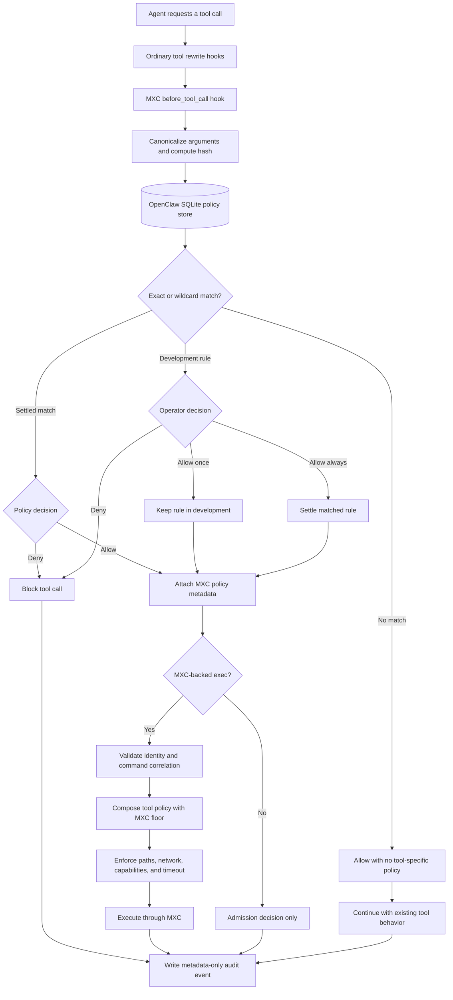

# Proposal: MXC Per-Tool Policy Advisor

## Summary

Add an MXC-owned policy advisor that evaluates individual OpenClaw tool calls
before execution. Policies can match a specific tool and argument set or all
calls to a tool, allow or deny the call, and provide a containment envelope for
MXC-backed execution. Policy state is stored in OpenClaw's SQLite state
database, unmatched calls remain allowed for compatibility, and policy
evaluation failures block the affected call.

## Motivation

OpenClaw currently applies a sandbox policy at a broader session or backend
scope. That is insufficient when different tools, or different calls to the
same tool, require different filesystem, network, capability, and timeout
access.

For example, an `exec` call that reads repository status should not
automatically receive the same containment grants as an `exec` call that builds
the repository or modifies files. A per-tool policy decision allows OpenClaw to
apply the smallest intended access for the individual call.

The policy decision also needs to remain close to the component that applies
the resulting containment. The MXC plugin already owns MXC backend integration,
while OpenClaw owns tool identity, plugin approvals, agent sessions, and
persistent application state. Keeping the policy advisor in the OpenClaw MXC
plugin provides one ownership boundary for local policy evaluation and MXC
enforcement without introducing a generic core policy framework before another
backend requires one.

The initial behavior should remain permissive when no policy exists. Enabling
the policy advisor must not unexpectedly stop existing tool workflows. A
matching policy can narrow or deny behavior, while a missing policy allows the
call without prompting or creating a new rule.

## Goals

- Evaluate tool calls against local policy before execution.
- Keep policy evaluation and MXC enforcement in the OpenClaw MXC plugin.
- Support exact and per-tool wildcard policy matching.
- Allow calls with no matching policy to preserve existing behavior.
- Allow settled policies to proceed without prompting.
- Prompt for an operator decision when a matching policy is still in
  development.
- Persist mutable policy state in OpenClaw's SQLite state database.
- Compose tool-specific containment with the built-in MXC floor using the most
  restrictive result.
- Validate policy authorization again at the MXC execution boundary.
- Record metadata-only audit events without storing raw tool arguments.
- Provide CLI commands for policy inspection and management.

## Non-Goals

- Add a generic OpenClaw core policy engine.
- Add a public Plugin SDK policy-provider contract.
- Define enterprise policy distribution, integrity, precedence, or rollback.
- Enforce MXC containment fields for every non-`exec` tool in the first
  increment.
- Add plugin approval support to every OpenClaw client.
- Migrate policies from another policy system.
- Define a cross-backend policy format.

## Proposal

### Ownership

The MXC plugin registers a low-priority `before_tool_call` hook. Ordinary hooks
can normalize or rewrite tool parameters first, then the MXC hook evaluates the
final argument object that would proceed to execution.

The MXC plugin owns:

- Argument canonicalization and hashing.
- Policy lookup and lifecycle.
- Operator approval requests.
- Policy audit events.
- Authorization metadata passed to MXC-backed execution.
- Composition of the selected tool policy with the built-in MXC floor.
- CLI commands used to inspect and manage policies.

OpenClaw core continues to own generic hook execution, approval transport,
agent sessions, tool execution, and plugin state infrastructure.

### Decision model

Each tool call resolves to one of three policy states:

| Policy state | Behavior |
|---|---|
| No matching policy | Allow the call without prompting or creating a policy |
| Settled exact or wildcard policy | Apply its allow or deny decision immediately |
| Matching in-development policy | Request `allow-once`, `allow-always`, or `deny` |

Policy-store read or parse failures are different from a missing policy. A
missing policy is the permissive compatibility case. A policy evaluation error
blocks the call because OpenClaw cannot determine whether a configured
restriction should apply.

The proposed flow is:



**Figure 1.** The MXC hook evaluates the final tool arguments. Missing policies
remain permissive, while matching policies can allow, deny, or request an
operator decision. MXC-backed `exec` calls receive containment enforcement.

### Policy matching

The policy advisor canonicalizes the final tool arguments and computes a stable
SHA-256 hash.

Canonicalization follows these rules:

- Object keys are sorted recursively.
- Array order remains significant.
- Scalar values retain their type and value.

The advisor checks policies in this order:

1. Exact tool name and canonical argument hash.
2. Wildcard policy for the tool.
3. No match.

An exact policy always takes precedence over a wildcard policy. A wildcard
policy uses the tool name with an empty argument hash.

### Policy lifecycle

Policies have two lifecycle states:

- `development`: The policy requires an operator decision before reuse.
- `settled`: The policy's allow or deny decision can be applied immediately.

Approval decisions have the following behavior:

| Decision | Current call | Policy result |
|---|---|---|
| `allow-once` | Allowed | Matching policy remains in development |
| `allow-always` | Allowed | Matching exact or wildcard policy becomes settled allow |
| `deny` | Blocked | Matching policy remains unchanged |
| Timeout or cancellation | Blocked | Matching policy remains unchanged |

An unmatched call does not enter this approval flow. Operators create or import
a development policy when they want a tool or argument pattern to require
review.

Automatic settlement may be enabled as an explicit opt-in. It applies only to
an existing in-development policy and does not create policies for unmatched
calls.

### Policy envelope

An allow policy can provide an MXC execution envelope with:

- Process timeout.
- Network posture.
- Local-network posture.
- Capabilities.
- Denied filesystem paths.
- Read-only filesystem paths.
- Read-write filesystem paths.

The selected envelope cannot widen the built-in MXC floor. The backend composes
the two using the most restrictive result.

Composition follows these principles:

- Deny is more restrictive than read-only.
- Read-only is more restrictive than read-write.
- A narrower path rule takes precedence when parent and child paths overlap.
- Network access can be narrowed but not widened.
- The lower timeout wins.
- Capabilities must remain within the built-in MXC grant.

Paths must be normalized for Windows and POSIX separators, case behavior, and
parent-child relationships before overlap is evaluated.

### Enforcement boundary

For an allowed policy match, the hook attaches versioned
`executionMetadata.mxcPolicy` containing:

- Authorized tool name.
- Canonical argument hash.
- Original `exec` command when applicable.
- Selected MXC execution envelope.

The MXC backend validates this metadata before applying it. For `exec`, the
backend confirms that the command reaching sandbox execution is the command
authorized by the hook.

Missing, malformed, or mismatched authorization metadata blocks policy-governed
MXC execution. This second validation prevents a rewritten or substituted
command from consuming authorization intended for another call.

### Initial enforcement scope

The hook evaluates all tools while local MXC policy is enabled. This provides a
consistent allow or deny decision point across the tool surface.

Containment fields affect only execution paths that consume MXC policy
metadata. MXC-backed `exec` is the first supported enforcement path. A
non-`exec` tool can be allowed or denied, but filesystem, network, capability,
and timeout fields do not change that tool's runtime behavior in the first
increment.

### Policy storage

Policies are mutable OpenClaw runtime state and are stored in the shared
OpenClaw state database:

```text
state/openclaw.sqlite
```

The MXC plugin uses the plugin-state API with a dedicated `tool-policies`
namespace. Each rule records:

- Tool name.
- Exact argument hash or wildcard marker.
- Value-free argument-shape summary.
- Allow or deny decision.
- MXC execution envelope.
- Lifecycle state.
- Usage count.
- Creation and last-used timestamps.
- Creation source.

The initial store is bounded to 5,000 policies. Operators manage policy state
through supported CLI commands rather than editing SQLite directly.

### Policy management

The MXC plugin provides:

```text
openclaw mxc policy list
openclaw mxc policy show <toolName>
openclaw mxc policy edit <toolName>
openclaw mxc policy settle <toolName>
openclaw mxc policy remove <toolName>
```

The CLI must support exact and wildcard policies without requiring direct
database access. A future export command can provide a reviewable or portable
representation if operational requirements justify one.

### Configuration

The proposed configuration is owned by `plugins.entries.mxc.config`:

| Field | Default | Purpose |
|---|---:|---|
| `localPolicyEnabled` | `true` | Evaluate tool calls against the MXC local policy store |
| `localPolicyAutoApprove` | `false` | Settle an existing development policy without prompting |
| `approvalTimeoutMs` | `1800000` | Set the plugin approval timeout |
| `approvalSeverity` | `warning` | Set the approval prompt severity |
| `auditLogPath` | State log directory | Override the JSONL audit path |

MXC-backed execution continues to require the MXC sandbox backend:

```json
{
  "agents": {
    "defaults": {
      "sandbox": {
        "mode": "all",
        "backend": "mxc"
      }
    }
  }
}
```

### Approval clients

Policy prompts use OpenClaw's generic plugin approval path. An approval-capable
client can resolve:

- Allow once.
- Allow always.
- Deny.

Clients that do not implement plugin approvals cannot resolve an
in-development policy prompt. The first implementation must document which
clients support the flow and the timeout behavior for unsupported clients.

### Audit

The default audit path is:

```text
<state-dir>/logs/mxc-policy.jsonl
```

Audit events include:

- Event type.
- Tool name.
- Argument hash.
- Session, run, and tool-call identifiers.
- Decision and decision source.
- Approval resolution.
- Duration and success state.

Audit events do not include raw tool arguments, command text, or error text.
Audit writes are serialized and best-effort so an audit failure does not report
a false tool execution failure.

### Security and correctness invariants

1. Policy lookup occurs before tool execution.
2. No matching policy allows the call without creating a rule.
3. Policy-store read and parse errors block the call.
4. Exact policies take precedence over wildcard policies.
5. Settled policies can proceed without prompting.
6. Automatic settlement remains opt-in.
7. A tool policy cannot widen the built-in MXC floor.
8. The backend validates authorization metadata independently.
9. MXC-backed `exec` validates command correlation before launch.
10. Runtime policy state is stored in SQLite, not an agent-writable sidecar.
11. Audit events do not persist raw tool payloads or error text.

## Rationale

### Store policies in SQLite instead of JSON

| Option | Advantages | Disadvantages |
|---|---|---|
| SQLite through the OpenClaw plugin-state API | Uses OpenClaw's canonical runtime state store; supports atomic updates and concurrent access; avoids another policy-file lifecycle; makes matching, counters, and lifecycle transitions straightforward; keeps runtime state out of an agent-visible sidecar | Harder for operators to inspect or edit directly; requires CLI or UI management; export, backup, and migration behavior must be deliberate; debugging is less convenient than opening a text file |
| JSON policy file | Human-readable; easy to copy, diff, review, and hand-author; simple for static deployment and early prototypes | Requires locking and atomic-write handling; creates another state and migration surface; direct edits can race with runtime updates; counters and lifecycle transitions become awkward; permissions and placement must prevent agent modification |

SQLite is preferred because these policies are mutable runtime state rather than
a static deployment artifact. Operator visibility should come from supported
CLI and export surfaces instead of direct database editing.

### Keep policy evaluation in the OpenClaw MXC plugin

Moving the policy advisor into MXC itself would place OpenClaw tool identity,
approval behavior, and application state in a lower-level containment
component. A separate package would add distribution and versioning complexity
before another consumer exists.

The OpenClaw MXC plugin is the narrowest owner that has access to both the
OpenClaw policy context and the MXC enforcement boundary.

### Do not add a generic core policy engine

A generic policy-provider framework would define a public cross-plugin contract
before requirements for other sandbox backends are understood. The plugin-owned
design can later inform a shared contract if a second backend demonstrates the
same need.

### Use exact and wildcard policies

Exact policies support argument-specific decisions and containment. Wildcard
policies provide a manageable fallback for tools whose calls should share one
decision. Exact-first matching allows an operator to define exceptions without
changing the broader wildcard rule.

### Allow unmatched calls

Failing closed for every unmatched call would turn the policy advisor into a
mandatory allowlist and could block existing installations as soon as the
feature is enabled. Allowing unmatched calls makes local policy additive:
operators can introduce restrictions intentionally without first inventorying
every tool and argument shape.

Policy errors still fail closed because an error may prevent OpenClaw from
applying a configured restriction.

## Unresolved questions

- Should plugin approval support be required in every interactive OpenClaw
  client before in-development policies are enabled by default?
- Should non-`exec` tools receive admission control before they have an MXC
  containment enforcement seam?
- What export, backup, and restore operations are required for SQLite policy
  state?
- Is 5,000 the correct initial policy limit?
- Should policy creation remain CLI-driven, or should a future learning mode
  propose development policies without blocking unmatched calls?
- What is the correct precedence when an implicitly allowed workspace or
  runtime path overlaps an explicit denied path?
- Which filesystem overlap cases must be proven across Windows and POSIX path
  semantics before denied-path enforcement is considered complete?
