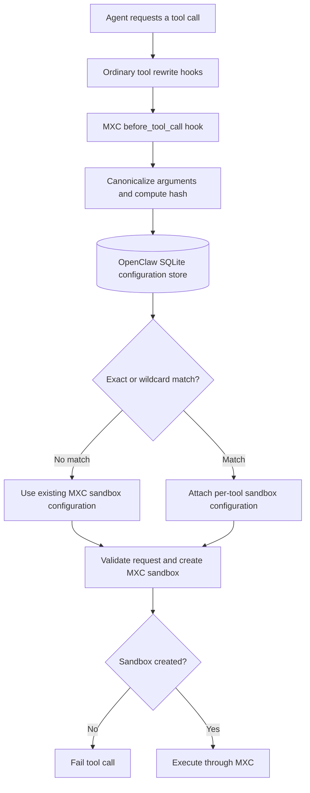

# Proposal: MXC Per-Tool Sandbox Configuration

## Summary

Add an MXC-owned configuration advisor that selects a sandbox configuration for
each OpenClaw tool call before execution. Configurations can match a specific
tool and argument set or all calls to a tool and provide a containment envelope
for MXC-backed execution.

Configuration state is stored in OpenClaw's SQLite state database and is
managed by the user through the OpenClaw CLI. Unmatched calls continue using
the existing MXC sandbox configuration for compatibility. If MXC cannot create
a sandbox with the selected per-tool configuration, the tool call fails.

## Motivation

OpenClaw currently applies one MXC sandbox backend configuration broadly.
Different tools, or different calls to the same tool, can require different
filesystem, network, capability, and timeout access.

For example, an `exec` call that reads repository status should not
automatically receive the same containment grants as an `exec` call that builds
the repository or modifies files. Per-tool sandbox configuration allows
OpenClaw to request the intended access for the individual call.

The configuration decision also needs to remain close to the component that
applies the resulting containment. The MXC plugin already owns MXC backend
integration, while OpenClaw owns tool identity, agent sessions, and persistent
application state. Keeping the configuration advisor in the OpenClaw MXC
plugin provides one ownership boundary for local configuration and MXC
enforcement.

The initial behavior should remain compatible when no per-tool configuration
exists. Enabling the configuration advisor must not unexpectedly stop existing
tool workflows.

## Goals

- Select a sandbox configuration for each OpenClaw tool call.
- Keep configuration selection and MXC enforcement in the OpenClaw MXC plugin.
- Support exact and per-tool wildcard configuration matching.
- Allow calls with no matching configuration to preserve existing behavior.
- Persist mutable configuration state in OpenClaw's SQLite state database.
- Prevent MXC-backed tool execution from directly modifying configuration
  state.
- Combine the built-in MXC baseline with tool-specific grants and restrictions.
- Validate configuration authorization again at the MXC execution boundary.
- Fail the tool call when MXC cannot create the requested sandbox.
- Record metadata-only audit events without storing raw tool arguments.
- Provide CLI commands for configuration inspection and management.

## Non-Goals

- Add a generic OpenClaw core configuration engine.
- Add a public Plugin SDK configuration-provider contract.
- Define built-in default configurations for individual tools.
- Configure or synchronize Windows Node sandbox settings.
- Enforce MXC containment fields for every non-`exec` tool in the first
  increment.
- Define the final user experience after sandbox creation fails.
- Define a cross-backend sandbox configuration format.

## Proposal

### Ownership

The MXC plugin registers a low-priority `before_tool_call` hook. Ordinary hooks
can normalize or rewrite tool parameters first, then the MXC hook evaluates the
final argument object that would proceed to execution.

The MXC plugin owns:

- Argument canonicalization and hashing.
- Configuration lookup.
- Configuration audit events.
- Authorization metadata passed to MXC-backed execution.
- Composition of the selected tool configuration with the built-in MXC
  baseline.
- CLI commands used to inspect and manage configurations.

OpenClaw core continues to own generic hook execution, agent sessions, tool
execution, and plugin state infrastructure.

### Configuration model

Each tool call resolves to one of two configuration states:

| Configuration state | Behavior |
|---|---|
| No matching configuration | Use the existing MXC sandbox configuration |
| Exact or wildcard configuration | Apply the selected per-tool containment envelope |

Configuration-store read or parse failures are different from a missing
configuration. A missing configuration is the compatibility case. A
configuration evaluation error blocks the call because OpenClaw cannot
determine the requested sandbox.

The proposed flow is:



**Figure 1.** The MXC hook selects the sandbox configuration for the final tool
arguments. MXC-backed execution fails if the requested sandbox cannot be
created.

### Configuration matching

The configuration advisor canonicalizes the final tool arguments and computes
a stable SHA-256 hash.

Canonicalization follows these rules:

- Object keys are sorted recursively.
- Array order remains significant.
- Scalar values retain their type and value.

The advisor checks configurations in this order:

1. Exact tool name and canonical argument hash.
2. Wildcard configuration for the tool.
3. No match.

An exact configuration always takes precedence over a wildcard configuration.
A wildcard configuration uses the tool name with an empty argument hash.

### Sandbox configuration envelope

A per-tool configuration can provide an MXC execution envelope with:

- Process timeout.
- Network posture.
- Local-network posture.
- Capabilities.
- Denied filesystem paths.
- Read-only filesystem paths.
- Read-write filesystem paths.

The effective MXC configuration combines the built-in MXC baseline with the
selected per-tool envelope. The baseline provides access common to all
MXC-backed calls. A per-tool configuration can add filesystem paths or
capabilities required by that tool while also applying tool-specific
restrictions.

Composition follows these principles:

- Deny is more restrictive than read-only.
- Read-only is more restrictive than read-write.
- A narrower path rule takes precedence when parent and child paths overlap.
- Per-tool configurations can add read-only paths, read-write paths, and
  capabilities.
- Per-tool configurations can narrow network access.
- The lower timeout wins.

Paths must be normalized for Windows and POSIX separators, case behavior, and
parent-child relationships before overlap is evaluated.

### Enforcement boundary

For a matching configuration, the hook attaches versioned
`executionMetadata.mxcSandbox` containing:

- Authorized tool name.
- Canonical argument hash.
- Original `exec` command when applicable.
- Selected MXC sandbox configuration.

The MXC backend validates this metadata before applying it. For `exec`, the
backend confirms that the command reaching sandbox execution is the command
authorized by the hook.

Missing, malformed, or mismatched authorization metadata blocks
configuration-governed MXC execution. This second validation prevents a
rewritten or substituted command from consuming configuration intended for
another call.

### Separate sandbox modes

The MXC plugin and Windows Node are separate sandbox modes for purposes of this
RFC.

Per-tool sandbox configurations apply only to commands executed through the
OpenClaw MXC plugin. Windows Node continues to use its own sandbox settings.
The MXC plugin does not read, compose with, or modify Windows Node settings,
and Windows Node does not read, compose with, or modify MXC plugin per-tool
configurations.

### Sandbox creation failure

MXC may be unable to create a sandbox with the selected per-tool
configuration. When this occurs:

- The tool call fails.
- OpenClaw reports that the requested sandbox could not be created.
- OpenClaw does not retry the command without MXC containment.

The longer-term user experience and any remediation flow require product
decisions and are outside this RFC.

### Initial enforcement scope

The hook can select configuration for all tools while local MXC per-tool
configuration is enabled.

Containment fields affect only execution paths that consume MXC configuration
metadata. MXC-backed `exec` is the first supported enforcement path. Other
tools can participate once they expose an MXC enforcement seam.

Calls executed through Windows Node are outside this configuration path and use
the separate Windows Node sandbox mode.

### Configuration storage

Configurations are mutable OpenClaw runtime state and are stored in the shared
OpenClaw state database:

```text
state/openclaw.sqlite
```

The MXC plugin uses the plugin-state API with a dedicated
`sandbox-configurations` namespace. Each entry records:

- Tool name.
- Exact argument hash or wildcard marker.
- Value-free argument-shape summary.
- MXC execution envelope.
- Usage count.
- Creation and last-used timestamps.
- Creation source.

The initial design does not impose an application-level configuration count
limit. Unmatched calls do not create configuration state, so store growth is
driven by user-created and imported entries. Users manage configuration state
through supported CLI commands rather than editing SQLite directly.

MXC containment must not grant tool execution write access to the OpenClaw
state directory. OpenClaw and trusted plugin code retain runtime access for
configuration and usage updates.

### Configuration management

The MXC plugin provides:

```text
openclaw mxc sandbox list
openclaw mxc sandbox show <toolName>
openclaw mxc sandbox edit <toolName>
openclaw mxc sandbox remove <toolName>
```

The CLI must support exact and wildcard configurations without requiring
direct database access. A future export command can provide a reviewable or
portable representation if operational requirements justify one.

### Configuration

The proposed plugin configuration is owned by `plugins.entries.mxc.config`:

| Field | Default | Purpose |
|---|---:|---|
| `perToolSandboxEnabled` | `true` | Select per-tool MXC sandbox configurations |
| `auditLogPath` | State log directory | Override the JSONL audit path |

MXC-backed execution continues to require the MXC sandbox backend:

```json
{
  "agents": {
    "defaults": {
      "sandbox": {
        "mode": "all",
        "backend": "mxc"
      }
    }
  }
}
```

### Audit

The default audit path is:

```text
<state-dir>/logs/mxc-sandbox.jsonl
```

Audit events include:

- Event type.
- Tool name.
- Argument hash.
- Configuration match source.
- Session, run, tool-call, and request identifiers.
- Requested access summary.
- Sandbox creation result.
- Duration and success state.

Audit events do not include raw tool arguments, command text, secrets, or error
text. Audit writes are serialized and best-effort so an audit failure does not
report a false tool execution failure.

### Security and correctness invariants

1. Configuration lookup occurs before tool execution.
2. No matching configuration uses the existing MXC sandbox configuration
   without creating an entry.
3. Configuration-store read and parse errors block the call.
4. Exact configurations take precedence over wildcard configurations.
5. The execution adapter validates authorization metadata independently.
6. MXC-backed `exec` validates command correlation before launch.
7. MXC plugin configurations and Windows Node sandbox settings do not influence
   one another.
8. Sandbox creation failure blocks execution and never triggers uncontained
   host fallback.
9. MXC containment does not grant tool execution write access to runtime
    configuration state.
10. Audit events do not persist raw tool payloads, command text, secrets, or
    error text.

## Rationale

### Store configurations in SQLite instead of JSON

| Option | Advantages | Disadvantages |
|---|---|---|
| SQLite through the OpenClaw plugin-state API | Uses OpenClaw's canonical runtime state store; supports atomic updates and concurrent access; makes matching and usage tracking straightforward | Requires CLI or UI management; export, backup, and migration behavior must be deliberate |
| JSON configuration file | Human-readable; easy to copy, diff, review, and hand-author | Requires locking and atomic-write handling; creates another state and migration surface; direct edits can race with runtime updates |

SQLite is preferred because these configurations are mutable runtime state.
User visibility and control come from supported CLI and export surfaces instead
of direct database editing.

### Keep configuration selection in the OpenClaw MXC plugin

Moving the configuration advisor into MXC itself would place OpenClaw tool
identity and application state in a lower-level containment component. A
separate package would add distribution and versioning complexity before
another consumer exists.

The OpenClaw MXC plugin is the narrowest owner that has access to both the
OpenClaw tool context and the MXC enforcement boundary.

### Do not add a generic core configuration engine

A generic configuration-provider framework would define a public cross-plugin
contract before requirements for other sandbox backends are understood. The
plugin-owned design can later inform a shared contract if a second backend
demonstrates the same need.

### Use exact and wildcard configurations

Exact configurations support argument-specific sandbox choices. Wildcard
configurations provide a manageable fallback for tools whose calls should
share one configuration. Exact-first matching allows a user to define a
specific exception without changing the broader wildcard configuration.

### Preserve compatibility for unmatched calls

Failing closed for every unmatched call could block existing installations as
soon as the feature is enabled.

An unmatched call therefore uses the existing MXC sandbox configuration.
Configuration read failures, authorization mismatches, and sandbox creation
failures still block the affected call.

## Unresolved questions

- Should exact configurations be keyed by the complete canonical argument hash,
  a value-free argument shape, or a more stable tool-defined identity?
- What is the correct precedence when an implicitly available workspace or
  runtime path overlaps an explicitly denied path?
- Which filesystem overlap cases must be proven across Windows and POSIX path
  semantics before denied-path enforcement is considered complete?
- What information should OpenClaw show when MXC cannot create the requested
  sandbox?
